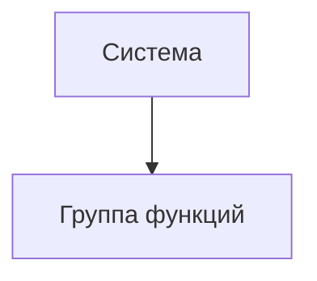

# Документ о концепции и границах кейса

| Поле | Значение |
|------|----------|
| Кейс | 05 - УЛО: управление лекарственным обеспечением |
| Индустриальный партнер | Комитет здравоохранения Волгоградской области (КЗВО) |
| Версия | `0.1-draft` |
| Дата | 2026-10-09 |
| Статус | черновик |
| Авторы | Колузаев К.М. (тимлид), Иванов Р.С., Архипов А.А. |

## 1. Введение

Краткая выжимка сути кейса: для кого система, какую проблему закрывает и чем отличается от текущего способа работы.

## 2. Бизнес-контекст и цели

### 2.1. Исходные данные

Как процесс устроен сейчас, какие потери времени / денег / качества наблюдаются, на каких фактах это основано.

### 2.2. Возможности бизнеса

Что изменится, если решение появится; какие смежные возможности откроются позже.

### 2.3. Бизнес-цели

| ID | Цель | Масштаб | Способ измерения | База | План | Обязательный порог | Срок |
|----|------|---------|------------------|------|------|--------------------|------|
| BO-1 | | | | | | | |
| BO-2 | | | | | | | |
| BO-3 | | | | | | | |

### 2.4. Видение решения

Одно-два предложения в формате: *для [пользователь], который [потребность], [имя системы] — это [тип продукта], который [ключевые возможности]. В отличие от [альтернатива], решение [отличие]*.

## 3. Стейкхолдеры

### 3.1. Профили заинтересованных лиц

| Заинтересованное лицо | Основная ценность | Отношение | Основные интересы | Ограничения |
|-----------------------|-------------------|-----------|-------------------|-------------|
| | | | | |

### 3.2. Матрица влияния / интереса

| Стейкхолдер | Влияние (низкое / среднее / высокое) | Интерес (низкий / средний / высокий) | Стратегия работы |
|-------------|--------------------------------------|--------------------------------------|------------------|
| | | | |

## 4. Функциональные требования

### 4.1. Основные функции

| ID | Функция | Краткое описание |
|----|---------|------------------|
| FE-1 | | |
| FE-2 | | |

### 4.2. Дерево функций

### 4.3. Пользовательские истории / варианты использования

| Основное действующее лицо | Варианты использования |
|---------------------------|------------------------|
| | |

### 4.4. Детальный сценарий (минимум один)

#### UC-1. _Название_

| Поле | Значение |
|------|----------|
| Автор / дата | |
| Основное действующее лицо | |
| Дополнительные действующие лица | |
| Описание | |
| Условие-триггер | |
| Предварительные условия | PRE-1. |
| Выходные условия | POST-1. |
| Приоритет | высокий / средний / низкий |
| Частота использования | |
| Бизнес-правила | BR-… |

**Нормальное направление**

1.
2.

**Альтернативные направления**

- 1.1 …

**Исключения**

- 1.0.E1 …

**Другая информация**

-

**Предположения**

-

### 4.5. Сжатые сценарии (по образцу Вигерса)

Остальные UC можно описать короче, если ключевая информация уже есть в другом источнике.

#### UC-n. _Название_

- Описание:
- Исключения:
- Приоритет:
- Бизнес-правила:
- Другая информация:

## 5. Нефункциональные требования

Требования сформулированы по материалам заказчика: письмо КЗВО («Задание заказчика УЛО»), протокол совещания от 27.06.2025, дорожные карты проекта, опросники КЗВО, ГУП «Волгофарм» и МИС БАРС. Если материалы не содержат числового значения, порог предложен командой и подлежит согласованию с КЗВО на установочной встрече.

| ID | Категория | Требование | Метрика / порог | Источник |
|----|-----------|------------|-----------------|----------|
| NFR-P1 | Производительность | Экран заявки с каталогом открывается быстро, итог и остаток лимита пересчитываются сразу после изменения позиции | открытие не более 3 с, пересчет не более 1 с для 95% запросов (предложено командой, согласовать с КЗВО) | Письмо КЗВО: Excel на рабочих компьютерах зависает; система должна сама считать стоимость; заявки должны составляться быстрее |
| NFR-P2 | Производительность | Поиск товара по каталогу | не более 2 с при каталоге до 50 000 позиций (предложено командой, согласовать с КЗВО) | Выгрузка справочника медицинских изделий (около 4 000 позиций) плюс лекарственные препараты и дезинфицирующие средства; запас на рост каталога |
| NFR-P3 | Производительность | Система выдерживает пиковую нагрузку в последний день сбора | не менее 200 одновременных пользователей без нарушения NFR-P1 (число уточнить у КЗВО) | Письмо КЗВО: КЗВО подчиняется много организаций, у сбора есть срок окончания |
| NFR-A1 | Доступность | Система доступна в рабочее время в период сбора заявок | не менее 99% времени с 8:00 до 18:00 (предложено командой, согласовать с КЗВО) | Письмо КЗВО: сроки сборов; несданные заявки приводят к разбирательствам |
| NFR-A2 | Надежность | Регулярное резервное копирование базы данных | ежедневно; потеря данных не более чем за 24 часа (предложено командой, согласовать с ВОМИАЦ) | Письмо КЗВО: на сервере уже используются RAID 5 и ленточная библиотека; дорожная карта: развертывание на мощностях КЗВО и ВОМИАЦ |
| NFR-S1 | Безопасность | Вход в систему только для авторизованных пользователей; действия ограничены правами роли | 100% функций доступны только ролям, которым они разрешены | Дорожная карта: подсистема аутентификации, распределенный доступ, разграничение ролей и прав доступа |
| NFR-S2 | Безопасность | Журнал действий с заявками и справочниками нельзя изменить или удалить через интерфейс | хранение записей не менее 3 лет (уточнить у КЗВО) | Письмо КЗВО: нужно разобраться после некорректной закупки и найти виновных; дорожная карта: логирование и история изменений сущностей |
| NFR-S3 | Безопасность | Защита передаваемых данных и персональных данных сотрудников | HTTPS на всех соединениях; обработка персональных данных по 152-ФЗ | Федеральный закон № 152-ФЗ «О персональных данных»; в заявках хранятся ФИО сотрудников (пример заявки П-27.11-30.11-2, поле «Автор заявки») |
| NFR-C1 | Совместимость | Работа через веб-браузер без установки программ на рабочие места | актуальные версии браузеров на базе Chromium (в т.ч. Яндекс Браузер) и Firefox | Дорожная карта: дизайн в стиле Госуслуг; письмо КЗВО: уйти от файлов на дисках к единой программной среде |
| NFR-C2 | Совместимость | Загрузка и синхронизация каталога с номенклатором ГУП «Волгофарм» | выпуск 1 — импорт выгрузки номенклатора; с выпуска 2 — REST API, формат JSON | Протокол: мастер-база остается у Волгофарма; дорожная карта: REST API для подключения поставщиков; формат API — вопрос опросника Волгофарма (уточнить) |
| NFR-C3 | Совместимость | Обмен данными с МИС «БАРС.Здравоохранение» для аналитики | REST API (выпуск 3) | Протокол: данные из БАРС выгружаются для аналитики; дорожная карта: REST API для интеграции с МИС БАРС; способ подключения — вопрос опросника БАРС (уточнить) |
| NFR-C4 | Совместимость | Выгрузка отчетов и сводных заявок в файлы | форматы XLSX и PDF | Опросник КЗВО: вопрос о формате отчетов (Excel, PNG, PDF, BI); выбраны XLSX и PDF как самые востребованные, уточнить у КЗВО |
| NFR-C5 | Совместимость | Работа на рабочих местах и сервере заказчика | соответствие минимальной конфигурации из раздела 7.4 | Письмо КЗВО: решение должно работать на имеющемся оборудовании, бюджет на новое не выделен (противоречие разобрано в 7.4 и RI-1) |
| NFR-U1 | Удобство | Все данные для составления заявки видны на одном экране | в UC-1 не требуется переход между вкладками и файлами | Письмо КЗВО: хотим, чтобы на экране было видно все и сразу |
| NFR-U2 | Удобство | Единый визуальный стиль в духе портала Госуслуг | макет интерфейса согласован с КЗВО | Дорожная карта: дизайн строго в стиле Госуслуг; письмо КЗВО: красивый интерфейс, в котором приятно работать |
| NFR-U3 | Обучение | Новый сотрудник МО осваивает составление заявки самостоятельно | не более 1 часа обучения; видеоинструкция не длиннее 5 минут (предложено командой) | Письмо КЗВО: людям должно стать легче работать; дорожная карта: пользовательские мануалы и обучение стейкхолдеров |

> [!NOTE]
> Пороги с пометкой «предложено командой» и «уточнить у КЗВО» выносятся в вопросы установочной встречи. После согласования пометки снимаются.

## 6. Границы кейса

### 6.1. In Scope

- …

### 6.2. Out of Scope

- …

### 6.3. Состав первого и последующих выпусков

| Функция | Выпуск 1 | Выпуск 2 | Выпуск 3 |
|---------|----------|----------|----------|
| FE-1 | | | |
| FE-2 | | | |

## 7. Ограничения и допущения

### 7.1. Ограничения и исключения

| ID | Формулировка |
|----|--------------|
| LI-1 | Тендерные процедуры и заключение контрактов выполняются тендерным отделом вне системы |
| LI-2 | Мастер-база номенклатуры остается в системе ГУП «Волгофарм»; УЛО хранит синхронизированную копию и не является источником истины для справочника |
| LI-3 | Складской и бухгалтерский учет в медицинских организациях, оплата поставок и логистика не входят в систему |
| LI-4 | Бюджет на закупку нового оборудования и операционных систем не выделен |
| LI-5 | Система предназначена только для организаций, подведомственных КЗВО, в контуре Волгоградской области |
| LI-6 | Контракты заключаются индивидуально с каждой больницей; система учитывает их как входные данные и объединяет только потребности, но не контракты |

### 7.2. Предположения и зависимости

| ID | Тип | Формулировка |
|----|-----|--------------|
| AS-1 | допущение | Заказчик обновит рабочие места и сервер хотя бы до минимальной конфигурации из 7.4 к началу опытной эксплуатации |
| AS-2 | допущение | В выпуске 1 ГУП «Волгофарм» предоставит выгрузку номенклатора для загрузки копии справочника; с выпуска 2 номенклатор доступен через API и обновляется не реже раза в сутки |
| AS-3 | допущение | У всех пользователей есть доступ к сети и электронная почта для уведомлений |
| AS-4 | допущение | КЗВО передаст структуру подведомственных организаций и лимиты до первого сбора |
| DE-1 | зависимость | Загрузка и синхронизация каталога зависят от ГУП «Волгофарм» и утвержденной структуры полей справочников |
| DE-2 | зависимость | Интеграция выпуска 3 зависит от наличия API и тестового стенда у МИС «БАРС.Здравоохранение» |
| DE-3 | зависимость | Развертывание зависит от серверных мощностей КЗВО и ВОМИАЦ |

### 7.3. Приоритеты проекта

| Область | Ограничения | Движущая сила | Степень свободы |
|---------|-------------|---------------|-----------------|
| Функции | Все функции выпуска 1 из 6.3 реализуются полностью | | Функции выпусков 2–3 можно переносить |
| Качество | | Снижение числа ошибок в заявках (BO-2) — главная причина проекта | |
| Сроки | Сроки этапов гранта: разработка, опытная эксплуатация, закрывающие документы | | Сдвиги внутри этапа — по согласованию с КЗВО |
| Расходы | Бюджет на новое оборудование не выделен (LI-4) | | |
| Персонал | | | Состав команды разработки определяет исполнитель |

### 7.4. Особенности развертывания

**Оборудование заказчика.** Заказчик просит, чтобы система работала на имеющихся компьютерах 2004 года: Pentium III 1 ГГц, 256 МБ ОЗУ, Windows 2000 Professional, ЭЛТ-монитор 1024×768. Сервер работает на Windows 2000 Server и MS SQL Server 2000. Выполнить это требование нельзя:

- актуальные браузеры не устанавливаются на Windows 2000, а современный веб-интерфейс в стиле Госуслуг (NFR-U2) в устаревших браузерах работать не будет;
- Windows 2000 и SQL Server 2000 давно не получают обновлений безопасности, что противоречит NFR-S3;
- 256 МБ ОЗУ недостаточно для современного браузера; Excel на этих компьютерах уже сейчас зависает.

Поэтому требование NFR-C5 выполняется через обновление оборудования до минимальной конфигурации (риск RI-1):

| Узел | Минимальная конфигурация (рекомендация) |
|------|------------------------------------------|
| Рабочее место | 2-ядерный процессор от 2 ГГц, 4 ГБ ОЗУ (рекомендуется 8 ГБ), SSD от 128 ГБ, монитор от 1366×768 (рекомендуется 1920×1080), ОС с поддержкой актуальных браузеров (Windows 10/11 или отечественный Linux-дистрибутив) |
| Сервер приложений и БД | 8 vCPU, 16 ГБ ОЗУ, SSD от 500 ГБ в RAID 1, поддерживаемая ОС и СУБД (например, PostgreSQL), резервное копирование |
| Сеть | Доступ рабочих мест к серверу по защищенному каналу |

**Обучение и документация.** Видеоинструкции (NFR-U3) и обучающие сессии для МО, КЗВО, ВОМИАЦ и Дирекции; руководства пользователя по ролям; руководство администратора по API, развертыванию и настройке.

## 8. Риски

| ID | Риск | Вероятность (0–1) | Ущерб (1–10) | Митигация |
|----|------|-------------------|--------------|-----------|
| RI-1 | Заказчик не обновит оборудование, и система будет медленно работать или не откроется на рабочих местах | 0,6 | 9 | Раннее согласование вопроса с КЗВО (7.4); легкий интерфейс без тяжелых библиотек; пилот на нескольких обновленных рабочих местах |
| RI-2 | Сотрудники продолжат вести заявки в Excel и мессенджерах | 0,4 | 7 | Обучение (NFR-U3); прием заявок только через систему по распоряжению КЗВО; контроль по метрике SM-3 |
| RI-3 | ГУП «Волгофарм» задержит выгрузку номенклатора в выпуске 1 или API в выпуске 2, либо изменит формат данных | 0,5 | 6 | Заранее согласовать структуру полей справочников; резервная загрузка из файла выгрузки |
| RI-4 | Дубли и ошибки в исходных справочниках: неверные наименования, нулевые и противоречивые цены | 0,7 | 5 | Правила проверки справочника на дубли при загрузке; очередь ручной проверки; очистка данных до запуска |
| RI-5 | Требования расширяются (BI-дашборды, анализ по нозологиям, экстренные заявки) и срывают выпуск 1 | 0,5 | 6 | Жесткие границы выпусков (раздел 6); новые пожелания — только в выпуски 2–3 |
| RI-6 | Пиковая нагрузка в последний день сбора | 0,4 | 6 | Нагрузочное тестирование по NFR-P3; заблаговременные напоминания о закрытии сбора |
| RI-7 | Нет базовых замеров Excel-процесса, и нельзя доказать достижение BO-1 и BO-2 | 0,5 | 4 | Хронометраж и анализ заявок одного сбора до внедрения |
| RI-8 | Неопределенность сроков проекта из-за расхождений в дорожных картах | 0,4 | 5 | Согласовать актуальный график с КЗВО на установочной встрече |

> [!WARNING]
> RI-1 может сорвать приемку выпуска 1: если рабочие места не соответствуют минимальной конфигурации, критерий AC-3 не будет выполнен. Решение по оборудованию нужно получить от КЗВО до начала опытной эксплуатации.

## 9. Критерии приемки

| ID | Критерий | Как проверяется | Порог | Срок |
|----|----------|-----------------|-------|------|
| SM-1 | Время составления и сведения заявки сократилось (BO-1) | Время от создания заявки до согласования по журналу системы в сравнении с замером Excel-процесса | не менее -20% | выпуск 1 + 1 месяц |
| SM-2 | Доля заявок с ошибками снизилась (BO-2) | Доля заявок, возвращенных на доработку, по журналу системы в сравнении с замером Excel-процесса | не менее -30% | выпуск 1 + 1 месяц |
| SM-3 | Сбор заявок переведен в единый контур (BO-3) | Число заявок в системе к общему числу заявок плановых сборов пилота | не менее 90% | выпуск 1 |
| SM-4 | Процесс прозрачен для администратора и руководителя (BO-4) | Доля заявок со статусом и историей изменений; все организации, не сдавшие заявку, видны на дашборде должников | 100% | выпуск 1 |
| SM-5 | Пользователи отмечают, что работать стало легче | Опрос сотрудников МО и администраторов по шкале 1–5 | средняя оценка не ниже 4 | выпуск 1 + 1 месяц |
| AC-1 | Функции выпуска 1 реализованы | Чек-лист функций выпуска 1 из 6.3 | 100% | приемка выпуска 1 |
| AC-2 | Качество | Приемочные тесты по вариантам использования выпуска 1 | не менее 95% тестов пройдено; 0 критических дефектов | приемка выпуска 1 |
| AC-3 | Производительность и совместимость на рабочих местах заказчика | Замер NFR-P1…NFR-P3 и проверка NFR-C5 на целевом оборудовании | пороги из раздела 5 | приемка выпуска 1 |
| AC-4 | Документация и обучение | Руководства по ролям, руководство администратора, проведенное обучение | все материалы переданы, обучение проведено | приемка выпуска 1 |

Партнер принимает выпуск 1, если выполнены AC-1…AC-4. Метрики SM-1…SM-5 подтверждают достижение бизнес-целей после запуска и используются как KPI пилота; пороги SM-1…SM-4 совпадают с обязательными порогами BO-1…BO-4 и согласуются с КЗВО вместе с ними.