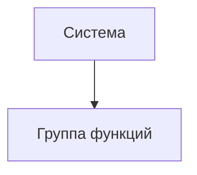

# Документ о концепции и границах кейса

| Поле | Значение |
|------|----------|
| Кейс | 05 - УЛО: управление лекарственным обеспечением |
| Индустриальный партнер | Комитет здравоохранения Волгоградской области (КЗВО) |
| Версия | `0.1-draft` |
| Дата | 2026-10-09 |
| Статус | черновик |
| Авторы | Колузаев К.М. (тимлид), Иванов Р.С., Архипов А.А. |

## 1. Введение

### Кейс
05 — УЛО: управление лекарственным обеспечением.
Партнер: Комитет здравоохранения Волгоградской области (КЗВО).

### Суть
Заменяем ручной сбор заявок в Excel и согласование в чатах единой программной средой.

Работник создает заявку в системе. Система сама считает сумму и проверяет ограничения.
Администратор модерирует и объединяет заявки. Руководитель согласует.

### Проблема
Сейчас каждый ведет свою таблицу. Администратор все пересчитывает вручную.
Хронология теряется в мессенджерах. Не видно статусы и должников.

### Отличие от текущего способа
Вместо файлов на дисках и переписки — один контур с ролями, статусами и журналом изменений.
Человек остается decision-maker, система убирает рутину и ошибки.

## 2. Бизнес-контекст и цели

### 2.1. Исходные данные

1. Работник ведет свою таблицу Excel. Он сам проверяет наличие у поставщика.
2. Он сам считает сумму и сравнивает с лимитом.
3. Заявка файлом уходит администратору. Администратор все пересчитывает и сводит вручную.
4. Замечания и согласование идут в мессенджерах. Хронология не восстанавливается.
5. Справочник обновляется вручную. Пропуск обновления дает ошибку с долгим исправлением.
6. Создание заявки разрознено: много вкладок и переключений.
7. Контроль лимитов, разрешенного ассортимента, остатков и сроков — на человеке.
8. Нет напоминаний об открытых сборах. Нет списка подразделений-должников.
9. Excel зависает на рабочих ПК. Есть план по цифровизации.

Последствия: долго, легко ошибиться, непонятно на каком этапе потерялась заявка.
Ошибки объединения приводят к коллапсам в выдаче. Разбор виновных без журнала невозможен.

### 2.2. Возможности бизнеса

- Единый экран заявки: товары, количество, сумма, лимиты и остатки видны сразу.
- Автопроверки: сумма, разрешенный ассортимент, остатки, сроки сбора.
- Напоминания об открытых сборах.
- Модерация и объединение заявок в системе, без скачивания файлов.
- Контроль должников: видно, кто не отправил заявку.
- Журнал изменений для разбора инцидентов.
- Позже: централизованный реестр потребностей, REST API для поставщиков и МИС.

### 2.3. Бизнес-цели

> Пороги ниже — проект для согласования с КЗВО на встрече. База = замеры Excel-процесса.

| ID | Цель | Масштаб | Способ измерения | База | План | Обязательный порог | Срок |
|----|------|---------|------------------|------|------|--------------------|------|
| BO-1 | Сократить время составления и сведения заявки | Все МО и КЗВО в пилоте | Замер времени от создания до согласования | Excel, [замерить] | -30% | -20% | Выпуск 1 + 1 месяц |
| BO-2 | Снизить долю заявок с ошибками | Все заявки пилота | Ошибки / всего заявок, по журналу возвратов на доработку | Excel, [замерить] | -50% | -30% | Выпуск 1 + 1 месяц |
| BO-3 | Перевести сбор в единый контур | Все плановые сборы пилота | Заявки в системе / всего заявок | 0% | 100% | 90% | Выпуск 1 |
| BO-4 | Сделать процесс прозрачным | Администратор, руководитель | Доля заявок со статусом и историей, доля должников на дашборде | 0% | 100% | 100% для Выпуска 1 | Выпуск 1 |

### 2.4. Видение решения

Для работника МО, который собирает заявку на лекарства, система «УЛО» — это веб-приложение для создания и согласования заявок, которое считает сумму, проверяет лимиты и остатки и ведет статусы.
В отличие от Excel-файлов и чатов, решение держит все в одном контуре с ролями и журналом.

## 3. Стейкхолдеры

### 3.1. Профили заинтересованных лиц

| Заинтересованное лицо | Основная ценность | Отношение | Основные интересы | Ограничения |
|-----------------------|-------------------|-----------|-------------------|-------------|
| | | | | |

### 3.2. Матрица влияния / интереса

| Стейкхолдер | Влияние (низкое / среднее / высокое) | Интерес (низкий / средний / высокий) | Стратегия работы |
|-------------|--------------------------------------|--------------------------------------|------------------|
| | | | |

## 4. Функциональные требования

### 4.1. Основные функции

| ID | Функция | Краткое описание |
|----|---------|------------------|
| FE-1 | | |
| FE-2 | | |

### 4.2. Дерево функций

### 4.3. Пользовательские истории / варианты использования

| Основное действующее лицо | Варианты использования |
|---------------------------|------------------------|
| | |

### 4.4. Детальный сценарий (минимум один)

#### UC-1. _Название_

| Поле | Значение |
|------|----------|
| Автор / дата | |
| Основное действующее лицо | |
| Дополнительные действующие лица | |
| Описание | |
| Условие-триггер | |
| Предварительные условия | PRE-1. |
| Выходные условия | POST-1. |
| Приоритет | высокий / средний / низкий |
| Частота использования | |
| Бизнес-правила | BR-… |

**Нормальное направление**

1.
2.

**Альтернативные направления**

- 1.1 …

**Исключения**

- 1.0.E1 …

**Другая информация**

-

**Предположения**

-

### 4.5. Сжатые сценарии (по образцу Вигерса)

Остальные UC можно описать короче, если ключевая информация уже есть в другом источнике.

#### UC-n. _Название_

- Описание:
- Исключения:
- Приоритет:
- Бизнес-правила:
- Другая информация:

## 5. Нефункциональные требования

| ID | Категория | Требование | Метрика / порог |
|----|-----------|------------|-----------------|
| NFR-P1 | Производительность | | |
| NFR-A1 | Доступность | | |
| NFR-S1 | Безопасность | | |
| NFR-C1 | Совместимость / IT-ландшафт | | |
| NFR-U1 | Удобство использования | | |

## 6. Границы кейса

### 6.1. In Scope

- …

### 6.2. Out of Scope

- …

### 6.3. Состав первого и последующих выпусков

| Функция | Выпуск 1 | Выпуск 2 | Выпуск 3 |
|---------|----------|----------|----------|
| FE-1 | | | |
| FE-2 | | | |

## 7. Ограничения и допущения

### 7.1. Ограничения и исключения

| ID | Формулировка |
|----|--------------|
| LI-1 | |

### 7.2. Предположения и зависимости

| ID | Тип | Формулировка |
|----|-----|--------------|
| AS-1 | допущение | |
| DE-1 | зависимость | |

### 7.3. Приоритеты проекта

| Область | Ограничения | Движущая сила | Степень свободы |
|---------|-------------|---------------|-----------------|
| Функции | | | |
| Качество | | | |
| Сроки | | | |
| Расходы | | | |
| Персонал | | | |

### 7.4. Особенности развертывания

Стек, инфраструктура, обучение пользователей, необходимые изменения смежных систем.

## 8. Риски

| ID | Риск | Вероятность (0–1) | Ущерб (1–10) | Митигация |
|----|------|-------------------|--------------|-----------|
| RI-1 | | | | |

> [!WARNING]
> Риски, которые могут сорвать приемку выпуска 1, вынесите сюда явно.

## 9. Критерии приемки

| ID | Критерий | Как проверяется | Порог | Срок |
|----|----------|-----------------|-------|------|
| SM-1 | | | | |
| AC-1 | | | | |

Партнер принимает работу, если выполнены все критерии со статусом «обязательный» и закрыты In Scope функции выпуска 1.
