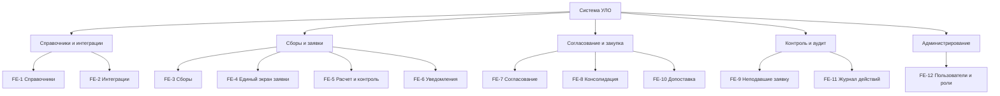

# Документ о концепции и границах кейса

| Поле | Значение |
|------|----------|
| Кейс | 05 - УЛО: управление лекарственным обеспечением |
| Индустриальный партнер | Комитет здравоохранения Волгоградской области (КЗВО) |
| Версия | `0.1-draft` |
| Дата | 2026-10-09 |
| Статус | черновик |
| Авторы | Колузаев К.М. (тимлид), Иванов Р.С., Архипов А.А. |

## 1. Введение

Краткая выжимка сути кейса: для кого система, какую проблему закрывает и чем отличается от текущего способа работы.

## 2. Бизнес-контекст и цели

### 2.1. Исходные данные

Как процесс устроен сейчас, какие потери времени / денег / качества наблюдаются, на каких фактах это основано.

### 2.2. Возможности бизнеса

Что изменится, если решение появится; какие смежные возможности откроются позже.

### 2.3. Бизнес-цели

| ID | Цель | Масштаб | Способ измерения | База | План | Обязательный порог | Срок |
|----|------|---------|------------------|------|------|--------------------|------|
| BO-1 | | | | | | | |
| BO-2 | | | | | | | |
| BO-3 | | | | | | | |

### 2.4. Видение решения

Одно-два предложения в формате: *для [пользователь], который [потребность], [имя системы] — это [тип продукта], который [ключевые возможности]. В отличие от [альтернатива], решение [отличие]*.

## 3. Стейкхолдеры

### 3.1. Профили заинтересованных лиц

| Заинтересованное лицо | Основная ценность | Отношение | Основные интересы | Ограничения |
|-----------------------|-------------------|-----------|-------------------|-------------|
| Комитет здравоохранения Волгоградской области (заказчик) | Прозрачное, управляемое и экономное лекарственное обеспечение | Инициатор, активный сторонник | Меньше ошибок и разбирательств, целевое расходование средств, следование плану цифровизации | Нет бюджета на новое оборудование |
| Сотрудник-заявитель | Быстро составить корректную заявку | Заинтересован | Единый экран, автоматический расчет суммы, подсказки об ошибках и открытых сборах | Устаревшее рабочее место, невысокая ИТ-грамотность |
| Администратор | Свести заявки без ручного пересчета и потерь файлов | Заинтересован | Единая очередь заявок, замечания внутри системы, объединение заявок, хронология | Большой объем заявок, много подчиненных организаций |
| Руководитель (согласующий) | Принять решение по готовой и проверенной заявке | Нейтральное / положительное | Видеть заявку целиком, быстро согласовать или вернуть | Ограниченное время, ответственность за итоговую закупку |
| Подведомственные организации | Своевременно и без претензий подать заявку | Нейтральное | Понятный порядок подачи, напоминания о сроках | Разный уровень оснащения и подготовки |
| Поставщики | Актуальные данные о товарах и остатках | Косвенное участие | Корректная передача изменений цен, остатков, ассортимента | Взаимодействие только через интеграцию (API), без работы в самой системе|
| Проверяющие лица (аудит) | Возможность восстановить ход событий | Заинтересованы | Журнал действий с авторством, неизменяемая история | Требования к хранению и доказательности данных |

### 3.2. Матрица влияния / интереса

| Стейкхолдер | Влияние (низкое / среднее / высокое) | Интерес (низкий / средний / высокий) | Стратегия работы |
|-------------|--------------------------------------|--------------------------------------|------------------|
| Комитет здравоохранения Волгоградской области (заказчик) | Высокое | Высокий | Управлять тесно: регулярные согласования, приемка по критериям |
| Сотрудник-заявитель | Среднее | Высокий | Интервью, тестирование прототипа, обратная связь по удобству |
| Администратор | Среднее | Высокий | Включить в проектирование, основной источник требований |
| Руководитель (согласующий) | Высокое | Средний | Вовлекать в проектирование сценария согласования, показывать прототипы |
| Подведомственные организации | Низкое | Средний | Информировать, обучать перед запуском |
| Поставщики | Низкое | Низкий | Минимальное взаимодействие, уточнить способ обмена данными (API, подтверждение заявок) |
| Проверяющие лица (аудит) | Среднее | Средний | Учесть требования к журналу действий, показывать отчеты |

## 4. Функциональные требования

### 4.1. Основные функции

| ID | Функция | Краткое описание |
|----|---------|------------------|
| FE-1 | Ведение единых справочников | Единый каталог товаров: МНН, дозировка, форма выпуска, торговые наименования, производитель; контроль дублей и уникальности кодов |
| FE-2 | Интеграция с внешними системами | Обмен данными по REST API с поставщиками (синхронизация номенклатуры, остатков, цен) и с МИС «Барс.Здравоохранение»; способ и состав данных уточняются |
| FE-3 | Управление сборами заявок | Создание сбора: срок, лимит суммы, допустимые категории товаров, список участников |
| FE-4 | Формирование заявки на едином экране | Выбор товаров и количества, просмотр лимитов, остатков и сроков без переключения между окнами |
| FE-5 | Автоматический расчет и контроль ограничений | Подсчет суммы по позициям и по заявке; проверка лимита суммы, допустимой категории товара, остатка у поставщика и срока сбора до отправки заявки |
| FE-6 | Уведомления и напоминания | Напоминания об открытых сборах и сроках; уведомления поставщика и КЗВО о запросе на допоставку |
| FE-7 | Статусы, модерация и согласование заявок | Маршрут сотрудник, администратор, руководитель; статусы (подтвержденные, ожидающие согласования, отклоненные); замечания и возврат на доработку внутри системы |
| FE-8 | Консолидация и распределение заявок | Объединение одобренных заявок подчиненных в сводную и передача вышестоящему уровню; динамика остатков и заказанных объемов, перераспределение квот между учреждениями по решению КЗВО |
| FE-9 | Контроль неподавших заявку | Список подразделений и пользователей, которые должны были подать заявку, но не подали |
| FE-10 | Запрос на увеличение объема закупки | Заявка на допоставку по контракту с проверкой лимитов и согласием поставщика |
| FE-11 | Журнал действий и история | Фиксация, кто, что и когда изменил; хронология замечаний и решений по заявке, записи не редактируются |
| FE-12 | Управление пользователями и ролями | Роли, привязка к организации и уровню иерархии, разграничение прав доступа |

### 4.2. Дерево функций

### 4.3. Пользовательские истории / варианты использования

### 4.3. Пользовательские истории / варианты использования

| Основное действующее лицо | Варианты использования |
|---------------------------|------------------------|
| Сотрудник-заявитель | UC-1. Составить и отправить заявку (включая доработку возвращенной); UC-2. Запросить увеличение объема закупки |
| Администратор | UC-3. Промодерировать заявку; UC-5. Объединить и распределить заявки; UC-6. Контролировать неподавших заявку; UC-7. Открыть сбор и задать ограничения; UC-8. Актуализировать справочник; UC-9. Управлять пользователями и ролями |
| Руководитель (согласующий) | UC-4. Согласовать или вернуть заявку |
| Комитет здравоохранения Волгоградской области (заказчик) | UC-5. Объединить и распределить заявки (перераспределение остатков) |
| Поставщики | UC-2. Запросить увеличение объема закупки (подтверждение допоставки); UC-8. Актуализировать справочник (передача изменений каталога) |
| Проверяющие лица (аудит) | UC-10. Восстановить историю заявки |

### 4.4. Детальный сценарий (минимум один)

#### UC-1. Составить и отправить заявку

| Поле | Значение |
|------|----------|
| Автор | Петров И.А. |
| Основное действующее лицо | Сотрудник-заявитель |
| Дополнительные действующие лица | Администратор (получатель заявки) |
| Описание | Сотрудник формирует заявку в рамках открытого сбора: выбирает товары, указывает количество, система считает стоимость и проверяет ограничения, после чего заявка отправляется администратору на модерацию |
| Условие-триггер | Сотрудник получил напоминание об открытом сборе или открыл список открытых сборов |
| Предварительные условия | PRE-1. Пользователь авторизован и имеет роль «сотрудник-заявитель». PRE-2. Сбор открыт, срок не истек. PRE-3. Справочник товаров актуален. |
| Выходные условия | POST-1. Заявка сохранена в статусе «На согласовании». POST-2. Администратор уведомлен. POST-3. Действия записаны в журнал. |
| Приоритет | высокий |
| Частота использования | Каждый сбор, каждым заявителем (периодичность сборов уточнить) |
| Бизнес-правила | BR-1. Сумма заявки не превышает лимит сбора. BR-2. Допускаются только товары разрешенных категорий. BR-3. Количество не превышает остаток у поставщика. BR-4. Отправка возможна только до окончания срока сбора. |

**Нормальное направление**

1. Сотрудник открывает список открытых сборов и выбирает нужный.
2. Система создает черновик заявки и показывает единый экран: каталог товаров, состав заявки, итоговую сумму, лимит, остатки и срок сбора.
3. Сотрудник находит товар в каталоге, добавляет его в заявку и указывает количество.
4. Система пересчитывает стоимость позиции и заявки, проверяет BR-1, BR-2, BR-3 и показывает остаток лимита.
5. Сотрудник повторяет шаги 3-4 для остальных позиций.
6. Сотрудник нажимает «Отправить».
7. Система повторно проверяет все ограничения, включая срок (BR-4), меняет статус на «На согласовании», уведомляет администратора и записывает действия в журнал.

**Альтернативные направления**

- 3.1 Сотрудник сохраняет черновик и возвращается к нему позже.
- 3.2 Сотрудник ищет товар по названию, МНН или категории.

**Исключения**

- 4.0.E1 Товар не относится к разрешенной категории: система не добавляет его и объясняет причину.
- 4.0.E2 Сумма превышает лимит: система предупреждает, отправка заявки блокируется до исправления.
- 4.0.E3 Количество превышает остаток у поставщика: система показывает доступное количество и просит скорректировать.
- 7.0.E1 Срок сбора истек: отправка блокируется, заявка остается черновиком.
- 7.0.E2 Данные поставщика (цена, остаток, ассортимент) изменились с момента добавления товара: система предупреждает и просит пересмотреть позицию.

**Другая информация**

- Все необходимое для составления заявки должно быть на одном экране, без переключения между окнами (требование заказчика).
- Интерфейс должен быть удобным и приятным в работе (требование заказчика). Ограничения рабочих мест заказчика фиксируются в разделе 5.

**Предположения**

- Сотрудник привязан к одной организации.
- Статус «Черновик» существует наряду со статусами из протокола (подтвержденные, ожидающие согласования, отклоненные).

### 4.5. Сжатые сценарии (по образцу Вигерса)

#### UC-2. Запросить увеличение объема закупки

- Описание: больница запрашивает допоставку по действующему контракту; система проверяет условия и направляет запрос поставщику и КЗВО; поставщик подтверждает или отклоняет допоставку.
- Исключения: нарушено любое из правил BR-6…BR-9; поставщик отказал (больница сокращает запрос или инициирует новый контракт через КЗВО).
- Приоритет: средний
- Бизнес-правила: BR-6. Не более 30% от суммы контракта и один раз за срок контракта. BR-7. Только с согласия поставщика и при наличии остатков. BR-8. Не выше общего лимита потребности. BR-9. Невозможно, если контракт заключен на 100% потребности. BR-10. Запрос имеет статус «на согласовании» и виден КЗВО и поставщику.
- Другая информация: поставщик и КЗВО получают уведомление о запросе (протокол, п. 3.4). Способ участия поставщика в системе и инициатор запроса в больнице не определены (уточнить).

#### UC-3. Промодерировать заявку

- Описание: администратор просматривает заявку подчиненного, проверяет ее, оставляет замечания и либо возвращает на доработку, либо передает дальше.
- Исключения: заявка уже обработана другим администратором того же уровня.
- Приоритет: высокий
- Бизнес-правила: BR-5. Замечания к заявке фиксируются только в системе, внешние мессенджеры не используются. Статусы заявок: подтвержденные, ожидающие согласования, отклоненные.
- Другая информация: хронология замечаний и решений доступна в карточке заявки.

#### UC-4. Согласовать или вернуть заявку

- Описание: руководитель просматривает заявку целиком, согласует ее либо возвращает на доработку с комментарием.
- Исключения: заявка отозвана автором до принятия решения.
- Приоритет: высокий
- Бизнес-правила: BR-5; возврат без комментария невозможен; согласованная заявка не редактируется.
- Другая информация: возможность делегирования на время отсутствия не определена (уточнить).

#### UC-5. Объединить и распределить заявки

- Описание: администратор выбирает одобренные заявки подчиненных, система формирует сводную заявку без ручного пересчета и передает ее вышестоящему уровню; при нехватке ресурсов КЗВО перераспределяет остатки и корректирует квоты между учреждениями.
- Исключения: среди выбранных есть неодобренные заявки; позиции дублируются в нескольких заявках; перераспределение нарушает лимиты потребности.
- Приоритет: высокий
- Бизнес-правила: объединяются только одобренные заявки; одинаковые позиции суммируются по количеству; сводная сумма не превышает лимит вышестоящего уровня (уточнить). BR-15. Распределение выполняется с учетом лимитов, установленных в потребности.
- Другая информация: в системе должна быть иерархия администраторов, так как заявки поднимаются снизу вверх. Динамика остатков и заказанных объемов должна быть видна в системе. Перераспределение описано только в протоколе от 27.06.25 (п. 2.1–2.2), в задании заказчика его нет.

#### UC-6. Контролировать неподавших заявку

- Описание: администратор видит список подразделений и пользователей, которые должны были подать заявку по сбору, но не подали, и может отправить им напоминание.
- Исключения: у пользователя не настроен канал уведомлений.
- Приоритет: средний
- Бизнес-правила: ожидаемые участники определяются настройками сбора (UC-7); напоминание получают только те, кто еще не отправил заявку.
- Другая информация: нужен заказчику, чтобы не проводить разбирательства постфактум. Каналы уведомлений не определены (уточнить).

#### UC-7. Открыть сбор и задать ограничения

- Описание: администратор создает сбор: задает срок, лимит суммы, допустимые категории товаров и список участников; система уведомляет участников об открытии сбора.
- Исключения: пересечение с другим открытым сбором для той же организации (уточнить).
- Приоритет: высокий
- Бизнес-правила: BR-1…BR-4 берутся из настроек сбора; изменение ограничений после открытия фиксируется в журнале.
- Другая информация: кто именно открывает сбор, в документах не сказано, предполагаем администратора (уточнить).

#### UC-8. Актуализировать справочник

- Описание: изменения ассортимента, цен и остатков поступают от поставщика через интеграцию; администратор обрабатывает их, система помечает затронутые черновики и заявки и уведомляет их авторов.
- Исключения: недоступность интеграции; ошибка формата; нарушение уникальности кодов.
- Приоритет: высокий
- Бизнес-правила: BR-12. Мастер-база номенклатуры остается в системе Волгофарма. BR-13. Для предотвращения дублей действуют строгие правила валидации при заполнении справочников. BR-14. Справочник двухуровневый: МНН, дозировка, форма выпуска, затем торговое наименование и производитель.
- Другая информация: способ интеграции (REST API, Excel, e-mail) и формат данных не определены, это вопросы опросника Волгафарма (уточнить). Изменение справочника не должно молча менять уже отправленные заявки (проектное решение, подтвердить с заказчиком).

#### UC-9. Управлять пользователями и ролями

- Описание: администратор создает и блокирует пользователей, назначает роли, привязку к организации и уровень иерархии.
- Исключения: попытка заблокировать последнего администратора.
- Приоритет: высокий
- Бизнес-правила: права определяются ролью и организацией.
- Другая информация: нужна для работы согласования и иерархии; отдельная роль «администратор системы» не определена (уточнить).

#### UC-10. Восстановить историю заявки

- Описание: проверяющий открывает журнал по заявке и видит, кто, когда и что менял, а также замечания и решения по заявке.
- Исключения: у пользователя нет прав на просмотр данных чужой организации.
- Приоритет: высокий
- Бизнес-правила: BR-11. Записи журнала нельзя изменять и удалять.
- Другая информация: поиск по пользователю, заявке и периоду; нужен заказчику для разбирательств после некорректной закупки.

## 5. Нефункциональные требования

| ID | Категория | Требование | Метрика / порог |
|----|-----------|------------|-----------------|
| NFR-P1 | Производительность | | |
| NFR-A1 | Доступность | | |
| NFR-S1 | Безопасность | | |
| NFR-C1 | Совместимость / IT-ландшафт | | |
| NFR-U1 | Удобство использования | | |

## 6. Границы кейса

### 6.1. In Scope

- …

### 6.2. Out of Scope

- …

### 6.3. Состав первого и последующих выпусков

| Функция | Выпуск 1 | Выпуск 2 | Выпуск 3 |
|---------|----------|----------|----------|
| FE-1 | | | |
| FE-2 | | | |

## 7. Ограничения и допущения

### 7.1. Ограничения и исключения

| ID | Формулировка |
|----|--------------|
| LI-1 | |

### 7.2. Предположения и зависимости

| ID | Тип | Формулировка |
|----|-----|--------------|
| AS-1 | допущение | |
| DE-1 | зависимость | |

### 7.3. Приоритеты проекта

| Область | Ограничения | Движущая сила | Степень свободы |
|---------|-------------|---------------|-----------------|
| Функции | | | |
| Качество | | | |
| Сроки | | | |
| Расходы | | | |
| Персонал | | | |

### 7.4. Особенности развертывания

Стек, инфраструктура, обучение пользователей, необходимые изменения смежных систем.

## 8. Риски

| ID | Риск | Вероятность (0–1) | Ущерб (1–10) | Митигация |
|----|------|-------------------|--------------|-----------|
| RI-1 | | | | |

> [!WARNING]
> Риски, которые могут сорвать приемку выпуска 1, вынесите сюда явно.

## 9. Критерии приемки

| ID | Критерий | Как проверяется | Порог | Срок |
|----|----------|-----------------|-------|------|
| SM-1 | | | | |
| AC-1 | | | | |

Партнер принимает работу, если выполнены все критерии со статусом «обязательный» и закрыты In Scope функции выпуска 1.
