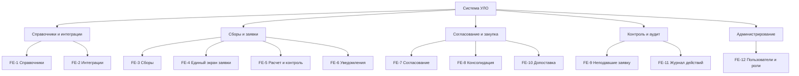

# Документ о концепции и границах кейса

| Поле | Значение |
|------|----------|
| Кейс | 05 - УЛО: управление лекарственным обеспечением |
| Индустриальный партнер | Комитет здравоохранения Волгоградской области (КЗВО) |
| Версия | `0.1-draft` |
| Дата | 2026-10-09 |
| Статус | черновик |
| Авторы | Колузаев К.М. (тимлид), Иванов Р.С., Архипов А.А. |

## 1. Введение

Краткая выжимка сути кейса: для кого система, какую проблему закрывает и чем отличается от текущего способа работы.

## 2. Бизнес-контекст и цели

### 2.1. Исходные данные

Как процесс устроен сейчас, какие потери времени / денег / качества наблюдаются, на каких фактах это основано.

### 2.2. Возможности бизнеса

Что изменится, если решение появится; какие смежные возможности откроются позже.

### 2.3. Бизнес-цели

| ID | Цель | Масштаб | Способ измерения | База | План | Обязательный порог | Срок |
|----|------|---------|------------------|------|------|--------------------|------|
| BO-1 | | | | | | | |
| BO-2 | | | | | | | |
| BO-3 | | | | | | | |

### 2.4. Видение решения

Одно-два предложения в формате: *для [пользователь], который [потребность], [имя системы] — это [тип продукта], который [ключевые возможности]. В отличие от [альтернатива], решение [отличие]*.

## 3. Стейкхолдеры

### 3.1. Профили заинтересованных лиц

| Заинтересованное лицо | Основная ценность | Отношение | Основные интересы | Ограничения |
|-----------------------|-------------------|-----------|-------------------|-------------|
| Комитет здравоохранения Волгоградской области (заказчик) | Прозрачное, управляемое и экономное лекарственное обеспечение | Инициатор, активный сторонник | Меньше ошибок и разбирательств, целевое расходование средств, следование плану цифровизации | Нет бюджета на новое оборудование |
| Сотрудник-заявитель | Быстро составить корректную заявку | Заинтересован | Единый экран, автоматический расчет суммы, подсказки об ошибках и открытых сборах | Устаревшее рабочее место, невысокая ИТ-грамотность |
| Администратор | Свести заявки без ручного пересчета и потерь файлов | Заинтересован | Единая очередь заявок, замечания внутри системы, объединение заявок, хронология | Большой объем заявок, много подчиненных организаций |
| Руководитель (согласующий) | Принять решение по готовой и проверенной заявке | Нейтральное / положительное | Видеть заявку целиком, быстро согласовать или вернуть | Ограниченное время, ответственность за итоговую закупку |
| Подведомственные организации | Своевременно и без претензий подать заявку | Нейтральное | Понятный порядок подачи, напоминания о сроках | Разный уровень оснащения и подготовки |
| Поставщики | Актуальные данные о товарах и остатках | Косвенное участие | Корректная передача изменений цен, остатков, ассортимента | Взаимодействие только через интеграцию (API), без работы в самой системе|
| Проверяющие лица (аудит) | Возможность восстановить ход событий | Заинтересованы | Журнал действий с авторством, неизменяемая история | Требования к хранению и доказательности данных |

### 3.2. Матрица влияния / интереса

| Стейкхолдер | Влияние (низкое / среднее / высокое) | Интерес (низкий / средний / высокий) | Стратегия работы |
|-------------|--------------------------------------|--------------------------------------|------------------|
| Комитет здравоохранения Волгоградской области (заказчик) | Высокое | Высокий | Управлять тесно: регулярные согласования, приемка по критериям |
| Сотрудник-заявитель | Среднее | Высокий | Интервью, тестирование прототипа, обратная связь по удобству |
| Администратор | Среднее | Высокий | Включить в проектирование, основной источник требований |
| Руководитель (согласующий) | Высокое | Средний | Вовлекать в проектирование сценария согласования, показывать прототипы |
| Подведомственные организации | Низкое | Средний | Информировать, обучать перед запуском |
| Поставщики | Низкое | Низкий | Минимальное взаимодействие, уточнить способ обмена данными (API, подтверждение заявок) |
| Проверяющие лица (аудит) | Среднее | Средний | Учесть требования к журналу действий, показывать отчеты |

## 4. Функциональные требования

### 4.1. Основные функции

| ID | Функция | Краткое описание |
|----|---------|------------------|
| FE-1 | Ведение единых справочников | Единый каталог товаров: МНН, дозировка, форма выпуска, торговые наименования, производитель; контроль дублей и уникальности кодов |
| FE-2 | Интеграция с внешними системами | Обмен данными по REST API с поставщиками (синхронизация номенклатуры, остатков, цен) и с МИС «Барс.Здравоохранение»; способ и состав данных уточняются |
| FE-3 | Управление сборами заявок | Создание сбора: срок, лимит суммы, допустимые категории товаров, список участников |
| FE-4 | Формирование заявки на едином экране | Выбор товаров и количества, просмотр лимитов, остатков и сроков без переключения между окнами |
| FE-5 | Автоматический расчет и контроль ограничений | Подсчет суммы по позициям и по заявке; проверка лимита суммы, допустимой категории товара, остатка у поставщика и срока сбора до отправки заявки |
| FE-6 | Уведомления и напоминания | Напоминания об открытых сборах и сроках; уведомления поставщика и КЗВО о запросе на допоставку |
| FE-7 | Статусы, модерация и согласование заявок | Маршрут сотрудник, администратор, руководитель; статусы (подтвержденные, ожидающие согласования, отклоненные); замечания и возврат на доработку внутри системы |
| FE-8 | Консолидация и распределение заявок | Объединение одобренных заявок подчиненных в сводную и передача вышестоящему уровню; динамика остатков и заказанных объемов, перераспределение квот между учреждениями по решению КЗВО |
| FE-9 | Контроль неподавших заявку | Список подразделений и пользователей, которые должны были подать заявку, но не подали |
| FE-10 | Запрос на увеличение объема закупки | Заявка на допоставку по контракту с проверкой лимитов и согласием поставщика |
| FE-11 | Журнал действий и история | Фиксация, кто, что и когда изменил; хронология замечаний и решений по заявке, записи не редактируются |
| FE-12 | Управление пользователями и ролями | Роли, привязка к организации и уровню иерархии, разграничение прав доступа |

### 4.2. Дерево функций

### 4.3. Пользовательские истории / варианты использования

| Основное действующее лицо | Варианты использования |
|---------------------------|------------------------|
| | |

### 4.4. Детальный сценарий (минимум один)

#### UC-1. _Название_

| Поле | Значение |
|------|----------|
| Автор / дата | |
| Основное действующее лицо | |
| Дополнительные действующие лица | |
| Описание | |
| Условие-триггер | |
| Предварительные условия | PRE-1. |
| Выходные условия | POST-1. |
| Приоритет | высокий / средний / низкий |
| Частота использования | |
| Бизнес-правила | BR-… |

**Нормальное направление**

1.
2.

**Альтернативные направления**

- 1.1 …

**Исключения**

- 1.0.E1 …

**Другая информация**

-

**Предположения**

-

### 4.5. Сжатые сценарии (по образцу Вигерса)

Остальные UC можно описать короче, если ключевая информация уже есть в другом источнике.

#### UC-n. _Название_

- Описание:
- Исключения:
- Приоритет:
- Бизнес-правила:
- Другая информация:

## 5. Нефункциональные требования

| ID | Категория | Требование | Метрика / порог |
|----|-----------|------------|-----------------|
| NFR-P1 | Производительность | | |
| NFR-A1 | Доступность | | |
| NFR-S1 | Безопасность | | |
| NFR-C1 | Совместимость / IT-ландшафт | | |
| NFR-U1 | Удобство использования | | |

## 6. Границы кейса

### 6.1. In Scope

- …

### 6.2. Out of Scope

- …

### 6.3. Состав первого и последующих выпусков

| Функция | Выпуск 1 | Выпуск 2 | Выпуск 3 |
|---------|----------|----------|----------|
| FE-1 | | | |
| FE-2 | | | |

## 7. Ограничения и допущения

### 7.1. Ограничения и исключения

| ID | Формулировка |
|----|--------------|
| LI-1 | |

### 7.2. Предположения и зависимости

| ID | Тип | Формулировка |
|----|-----|--------------|
| AS-1 | допущение | |
| DE-1 | зависимость | |

### 7.3. Приоритеты проекта

| Область | Ограничения | Движущая сила | Степень свободы |
|---------|-------------|---------------|-----------------|
| Функции | | | |
| Качество | | | |
| Сроки | | | |
| Расходы | | | |
| Персонал | | | |

### 7.4. Особенности развертывания

Стек, инфраструктура, обучение пользователей, необходимые изменения смежных систем.

## 8. Риски

| ID | Риск | Вероятность (0–1) | Ущерб (1–10) | Митигация |
|----|------|-------------------|--------------|-----------|
| RI-1 | | | | |

> [!WARNING]
> Риски, которые могут сорвать приемку выпуска 1, вынесите сюда явно.

## 9. Критерии приемки

| ID | Критерий | Как проверяется | Порог | Срок |
|----|----------|-----------------|-------|------|
| SM-1 | | | | |
| AC-1 | | | | |

Партнер принимает работу, если выполнены все критерии со статусом «обязательный» и закрыты In Scope функции выпуска 1.
